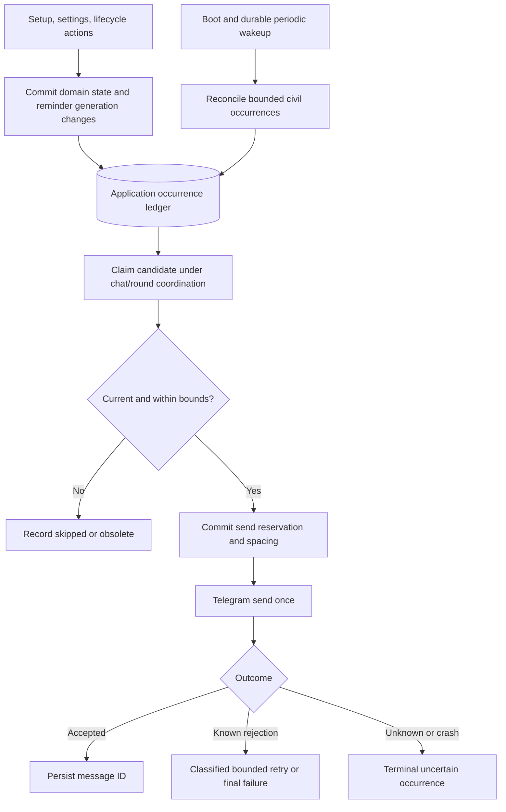

# Phase 05: Proactive Reliable Reminders - Research

**Researched:** 2026-09-13
**Domain:** Durable reminder orchestration, Telegram delivery, civil-time scheduling
**Confidence:** MEDIUM for source-backed implementation guidance; LOW for provider-seam confidence (see Metadata).

<user_constraints>
## User Constraints (from CONTEXT.md)

The following decisions and research responsibilities are copied verbatim from the phase context. [CITED: .planning/phases/05-proactive-reliable-reminders/05-CONTEXT.md]

<!-- DATA_q7w4k9m2_START -->
## Implementation Decisions

### Planning-start reminders
- **D-01:** Remind at 10:00 in the chat timezone from Monday, then daily until planning starts for the target week. An existing active planning process suppresses these reminders, including a draft; do not confuse that check with the confirmed/booked week-claim predicate.
- **D-02:** Once this week's rehearsal is agreed, reminders for next week wait until next Monday at 10:00. Do not immediately chase the next unplanned week. Earlier manual planning remains available.
- **D-03:** After cancellation frees the current week, suppress planning-start reminders for the remainder of that week. Resume eligibility next Monday; manual planning remains available immediately. This suppression must survive restart.
- **D-04:** A planning-start reminder contains the target week and a Start planning button, without mentions. The button checks current planning permissions and uses the existing planning flow; the message is not authorization.
- **D-05:** After initial setup midweek, the first eligible reminder is the next 10:00, not immediately and not necessarily next Monday.

### Participant follow-ups
- **D-06:** Send a fresh message containing rehearsal date/time, real mentions of only pending participants in the current round's authoritative snapshot, and a link to the current card. Answer buttons remain on the card; do not duplicate them on reminder messages.
- **D-07:** Pause follow-ups while any unavailable answer blocks the slot. If that answer changes and the slot becomes viable with pending participants, resume at scheduled times. New rounds use the existing current-roster snapshot behavior; old-round jobs cannot target their successor implicitly.
- **D-08:** Stop follow-ups at the scheduled rehearsal start even when responses remain outstanding. Completion, booking, cancellation and supersession also suppress inapplicable follow-ups.
- **D-09:** Allow at least 30 minutes after availability-card publication before a follow-up. Skip scheduled occurrences inside this grace period; do not defer them to an arbitrary publication-plus-30-minutes send.
- **D-10:** Maintain at least 30 minutes between reminders for the same round, including recovery and settings changes. Skip closer scheduled occurrences. Exactly 30 minutes satisfies the minimum.

### Recovery after downtime
- **D-11:** On recovery, send one currently relevant missed reminder if lateness is at most two hours, inclusive. Skip older occurrences and coalesce accumulated eligible occurrences rather than replaying a backlog. Re-evaluate current state and pending participants before delivery; recovery never revives obsolete reminders.
- **D-12:** If the delivery outcome is unknown, do not retry that occurrence. The user accepts a possible missed reminder to avoid a duplicate; future scheduled reminders remain eligible. Distinguish this from a known rejection before delivery. Do not promise guaranteed exactly-once Telegram delivery.
- **D-13:** Send an eligible catch-up immediately even if the next scheduled reminder is imminent. Skip that next occurrence if it falls less than 30 minutes after the catch-up. This explicitly overrides the offered recommendation to wait for the imminent occurrence.
- **D-14:** Do not send separate outage/recovery notices to the group. Record failures in technical logs and resume under these rules.

### Settings changes
- **D-15:** Apply saved reminder-time changes immediately to current and future rounds. Cancel future work under the old schedule.
- **D-16:** Generate only future occurrences after a settings change. Adding a time already past today does not create a missed occurrence or trigger catch-up.
- **D-17:** Apply a changed chat timezone immediately to future reminder occurrences, preserving configured local wall-clock times: 10:00 means 10:00 in the new timezone. This decision concerns reminders, not rescheduling an already agreed rehearsal.
- **D-18:** A settings change does not reset the same-round 30-minute minimum interval or bypass publication grace.

### Requirement clarification for planning
- D-03 is an explicit exception to REM-01's broad daily-until-started wording: cancellation intentionally silences planning-start reminders for the rest of the current week. Reconcile acceptance wording during planning; do not implement automatic next-day resumption after cancellation.
- D-02 separates proactive weekly eligibility from the existing manual target-week search, which can look ahead. Reuse date arithmetic without treating every manually selectable future week as immediately reminder-eligible.
- D-07 and D-08 narrow REM-03's incomplete-availability condition: a blocked or already-started slot does not merit outstanding-participant reminders.
- RELI-02's duplicate-record and transition guarantees remain required; D-12 defines the user-approved tradeoff for uncertain external delivery.

### Agent's Discretion and Research Responsibilities
No additional product preferences were explicitly delegated. Resolve implementation details within the decisions above: durable occurrence identity, atomic claims, queue integration, stale-job checks, retry classification for known non-delivery, and migration/test coverage.

Research and planning must document DST gap/overlap handling, usable card-link behavior across supported Telegram group types and re-anchoring, publication-grace behavior after failed publication recovery, and week-boundary handling under timezone changes. Do not present these unasked edge cases as user-selected policies. Preserve current single-polling-process deployment assumptions and existing authorization boundaries.

## Deferred Ideas

None — discussion stayed within phase scope. Existing milestone exclusions remain unchanged.
<!-- DATA_q7w4k9m2_END -->
</user_constraints>

## Summary

Build a durable application occurrence ledger and use pg-boss only to wake a reconciler/dispatcher. The ledger must decide whether a reminder is eligible, already consumed, obsolete, too late, or unsafe to repeat. This is an implementation recommendation derived from D-01–D-18: queue retries alone cannot express the accepted unknown-delivery tradeoff. Preserve the existing lifecycle service and its authoritative availability projection. [CITED: .planning/phases/05-proactive-reliable-reminders/05-CONTEXT.md]

Add durable schedule generation boundaries, publication acknowledgement, cancellation suppression and per-round delivery spacing before integrating Telegram sends. Recovery must reconstruct a bounded missed window from durable inputs, select one current occurrence per reminder stream, and atomically consume siblings. A claim committed before a send is the linearization point; a crash thereafter means possible non-delivery, never automatic resend. This intentionally favors avoiding duplicates and does not assert exactly-once external delivery. [CITED: .planning/phases/05-proactive-reliable-reminders/05-CONTEXT.md]

**Primary recommendation:** Implement a migration-first, single-polling-process vertical slice from one unique occurrence through an atomic claim to one Telegram send, then add calendar reconciliation, lifecycle invalidation and recovery.

## Architectural Responsibility Map

These are proposed assignments derived from the phase decisions, not existing component claims. [CITED: .planning/phases/05-proactive-reliable-reminders/05-CONTEXT.md]

| Capability | Primary Tier | Secondary Tier | Rationale |
|---|---|---|---|
| Civil recurrence and eligibility | Domain/backend | Time adapter | Calendar policy is pure and clock-injected |
| Occurrence uniqueness, claims, generation cutoff, spacing | Database | Domain/backend | Survives process replacement and races |
| Durable wakeups and recovery scans | Backend worker | PostgreSQL queue | Queue transports work; ledger authorizes delivery |
| Current pending participants and lifecycle | Existing domain service | Database | Reuse one authoritative snapshot and outcome |
| Card links, mentions, callback acknowledgement | Telegram adapter | Domain authorization | Presentation and external outcome stay outside transactions |
| Schedule edits/cancellation/chat migration | Existing domain transactions | Reminder repository | Invalidate obsolete work atomically |
| Startup, shutdown, logging | Application root | Queue and Prisma pools | One worker lifecycle and bounded cleanup |

<phase_requirements>
## Phase Requirements

Descriptions below are copied from the requirements; clarification in the user constraints takes precedence. [CITED: .planning/REQUIREMENTS.md]

| ID | Description | Research Support |
|---|---|---|
| REM-01 | If weekly planning has not started, the bot reminds the chat on Monday at 10:00 and daily at 10:00 until it starts. | Current-week occurrence generator; cancellation exception; setup cutoff |
| REM-02 | Planning-start reminders stop as soon as an active planning process exists for the target week. | Dedicated active-process check including drafts |
| REM-03 | While availability is incomplete, the bot sends follow-ups at the chat's configured reminder times. | Live schedule generation, grace, spacing, blocked/start suppression |
| REM-04 | Each availability follow-up mentions only participants who have not answered. | Fresh snapshot projection at claim/send boundary |
| REM-05 | The bot suppresses obsolete reminders after replanning, completion, cancellation, or another relevant state change. | Round identity and generation checks, lifecycle transaction hooks |
| RELI-02 | Repeated Telegram updates or button callbacks do not create duplicate plans, votes, transitions, or reminder records. | Unique occurrence keys, compare-and-set, existing replay regression tests |
| RELI-03 | Restarting or redeploying the bot resumes outstanding reminders without reviving obsolete ones. | Durable reconstruction, inclusive two-hour window, unknown finalization |
</phase_requirements>

## Project Constraints (from AGENTS.md)

The actionable directives below come from the project instructions and accumulated project state. [CITED: AGENTS.md; .claude/CLAUDE.md; .planning/STATE.md]

- Keep primary interactions in Telegram group chat; use the persistent administrator-managed roster and per-chat schedule.
- No automatic booking or private reminder messages.
- Write documentation in English and keep scripts usable from Codex and Claude Code.
- Remain within the initiated GSD workflow; this artifact is research for the authorized phase-planning workflow.
- Preserve strict TypeScript including unchecked-index and exact-optional checks; follow existing modules and conventions.
- Use PostgreSQL/Prisma durable state, explicit migrations and revision checks. Preserve migration-first deployment and exact migration catalog/history agreement.
- Use compact opaque callbacks, current action-boundary authorization, exactly one acknowledgement, idempotent repeated actions, and bigint database identifiers.
- Use structured redacted logs; never expose tokens, database credentials or participant payloads.
- Keep privacy mode compatible and keep durable workflow authority out of in-memory Telegram sessions.
- Preserve one polling process and existing chat serialization. Queue workers do not automatically participate in grammY serialization.
- Keep Docker deployment portable, secrets outside committed Compose configuration, and migration tooling in the migration image.
- Verify formatting, types, unit tests, real-PostgreSQL migration/integration behavior, and container build for the delivered phase.
- Apply the Telegram Web UAT skill when executing live UAT; planning does not perform live actions.

## Standard Stack

Reuse the installed lockfile; this phase is not a general dependency upgrade. The following existing version strings were read from the manifest: `"grammy": "1.45.1"`, `"@grammyjs/runner": "2.0.3"`, `"@prisma/client": "7.9.1"`, `"@prisma/adapter-pg": "7.9.1"`, `"pg": "8.23.0"`, `"pino": "10.3.1"`, `"zod": "4.4.3"`, `"vitest": "4.1.11"`, `"testcontainers": "12.1.0"`, `"typescript": "7.0.2"`. These are project pins, not a claim that every dependency remains latest. [VERIFIED: package.json:26-46]

| Component | Version | Use |
|---|---|---|
| Existing Node/TypeScript, grammY, Prisma, pg, Zod, Pino | Manifest pins above | Preserve current application boundaries |
| pg-boss [WARNING: flagged as suspicious — verify before using.] | Proposed exact pin 12.27.0 | Durable wakeups, job execution and lifecycle |
| Existing civil/time adapter | Repository implementation | Generate local dates and resolve DST once |
| Existing Vitest/Testcontainers | Manifest pins above | Deterministic policy and real-database claim tests |

The official pg-boss repository identifies the package, and npm metadata confirms the proposed pin exists, requires Node >=22.12.0, and was published 2026-08-03T16:33:23Z. Registry latest was 12.31.0 during research. Neither registry existence nor pin age overrides the package gate below. [CITED: https://github.com/timgit/pg-boss; npm view pg-boss@12.27.0 version engines; npm view pg-boss time]

**Installation:** Execution may add the exact pin only after resolving the audit checkpoint. No package was installed during research. Do not introduce another date-time library or Redis for this phase. The existing resolver exposes the required gap/overlap outcomes. [VERIFIED: src/infrastructure/time/zoned-clock.ts:121-124] Verbatim: `kind: "unique"`, `kind: "ambiguous"`, `kind: "skipped"`.

### Alternatives Considered

| Alternative | Strongest benefit | Decision |
|---|---|---|
| Database-only periodic scanner | Fewer dependencies and no queue DDL | Keep application reconciler small, but follow selected pg-boss stack for durable wakes |
| One cron per chat/round | Familiar configured wall-clock schedule | Does not replace application grace, coalescing or unknown-delivery ledger |
| In-memory timers | Simple short-lived wakeups | Never use as durable scheduling authority |

These are architectural tradeoffs/recommendations derived from the recovery and settings requirements, not product preferences. [CITED: .planning/phases/05-proactive-reliable-reminders/05-CONTEXT.md]

## Package Legitimacy Audit

| Package | Registry | Age | Downloads | Source Repo | Verdict | Disposition |
|---|---|---|---|---|---|---|
| pg-boss | npm | Package created 2016-03-18; pin published Aug 3; latest published Sep 10 | 1,263,047/week from seam | github.com/timgit/pg-boss | SUS: too-new | Retain exact-pin proposal with explicit dependency review before installation |

Evidence: official repository plus registry queries and `query package-legitimacy check --ecosystem npm pg-boss`. The seam evaluates the latest publication timestamp and flagged that age; it did not flag missing repository, nonexistent package, deprecation or postinstall script. npm returned no postinstall for the pin. [CITED: https://github.com/timgit/pg-boss; package-legitimacy seam output, 2026-09-13]

**Removed packages:** none. **Suspicious packages:** pg-boss, exact reason above. The researcher protocol explicitly says: “The planner must add a `checkpoint:human-verify` task before installing this package.” Preserve that future execution checkpoint; there is no installation or user approval needed to finish planning. The verified older pin is relevant review evidence, not permission to relabel the seam verdict OK.

## Architecture Patterns

### System Architecture Diagram

Proposed flow derived from the phase constraints. [CITED: .planning/phases/05-proactive-reliable-reminders/05-CONTEXT.md]



### Existing Source Contracts

Keep these distinct source-of-truth values intact:

- Week-claim set is `PlanningRoundStatus.CONFIRMED`, `PlanningRoundStatus.BOOKED`; a draft is intentionally excluded. [VERIFIED: src/domain/planning/target-week.ts:42-45]
- Lifecycle enum is `DRAFT`, `CONFIRMED`, `SUPERSEDED`, `BOOKED`, `CANCELLED`, in that order. [VERIFIED: prisma/schema.prisma:44-50]
- Shared availability outcomes are `"collecting"`, `"all-available"`, `"blocked"`; the function checks `"unavailable"` before `"pending"`. An empty list returns collecting, so additionally require at least one pending participant. [VERIFIED: src/domain/planning/planning-service.ts:757-765]
- Publication-related existing columns are `anchorMessageId`, `startsAt`, `endsAt`, `confirmedAt`, `lastActivityAt`, `lastStatusPostedAt`; none is an acknowledged availability-card publication timestamp. Add a dedicated field rather than pretending confirm time proves delivery. [VERIFIED: prisma/schema.prisma:208-213]
- Current reanchor writes `anchorMessageId: messageId`, `lastStatusPostedAt: now`, `revision: { increment: 1 }`. Preserve optimistic guarding when extending it. [VERIFIED: src/domain/planning/planning-service.ts:4297-4309]

### Proposed Durable Data Model

Names below are proposed, not existing schema values. Add exact migration/model definitions before any executor uses them.

1. **Chat reminder schedule state:** generation/version, effective-from instant, canonical chat identity, cancellation-week suppression data. Initial setup writes the boundary in its commit; relevant settings changes increment generation and replace effective-from in their commit.
2. **Occurrence ledger:** unique composite identity of canonical chat, reminder kind, scope (target week or immutable round ID), schedule generation, civil date and configured minute. Store resolved due instant, current disposition, claim owner/attempt identity, attempted/finished times, accepted message ID and bounded diagnostic reason.
3. **Round delivery state:** first acknowledged availability publication time, current-anchor publication acknowledgement/generation, last potentially delivered reminder time. Preserve spacing across reminder configuration generations.
4. **Indexes/constraints:** uniqueness for occurrences; due/disposition indexes; valid foreign keys or explicit migration ownership for chat/round references. Queue payload contains only durable occurrence/stream identity, never a frozen participant list or authorization assertion.

These implementation proposals fulfill durable idempotency and scheduling changes; exact naming is planner discretion. [CITED: .planning/phases/05-proactive-reliable-reminders/05-CONTEXT.md]

### Atomic claim and coordination

A transaction must reload configuration, exact round, snapshot participants, publication/spacing state and occurrence generation; then atomically consume the occurrence and reserve the same-round spacing clock. Claiming two different occurrences must contend on the same round/chat state row, not merely different ledger rows. Use guarded updates or row locking with a consistent lock order. PostgreSQL row locks persist through transaction end. [CITED: https://www.postgresql.org/docs/current/explicit-locking.html]

Use a shared application chat coordinator for Telegram updates and reminder dispatch, preserving existing migration-key coordination, and make database compare-and-set the durable safety mechanism. A scheduler running beside grammY does not inherit its middleware lock. Serialize final validation and send dispatch against lifecycle/settings handlers in the one-process deployment; avoid holding a database transaction across network I/O. A lifecycle change committed after the send reservation cannot retroactively revoke an in-flight HTTP request; document this boundary rather than promise impossible instantaneous cancellation. [CITED: src/app/create-bot.ts; .planning/STATE.md; .planning/phases/05-proactive-reliable-reminders/05-CONTEXT.md]

### Calendar and recovery algorithm

Implement one clock-injected pure enumerator and a separate relevance predicate. Decisions below are recommendations within the explicit research responsibilities. [CITED: .planning/phases/05-proactive-reliable-reminders/05-CONTEXT.md]

1. Planning starts target only the current chat-local Monday week. Never invoke the manual lookahead search to choose a proactive future week. Require no active draft/process for that week, no claimed week, and no cancellation suppression.
2. Initial setup only creates instants strictly after setup commit. Exactly-at-10:00 setup waits for the next scheduled occurrence. A newly installed scheduler over existing configurations needs a persisted activation boundary, avoiding invented pre-feature backlog.
3. Follow-up enumeration uses current chat reminder times/timezone, but compares rehearsal cutoff against the round's already fixed start instant. Sort and deduplicate reminder minutes (equal configured times produce one logical occurrence).
4. Resolve each civil occurrence using the existing resolver: skip nonexistent wall times; choose the earlier instant once for overlaps. These extend the existing rehearsal-time policy as implementation recommendations, not newly user-selected behavior.
5. On recovery enumerate only due times at/after the generation boundary and within two hours, inclusive. Use durable generation/history and ledger state to distinguish a real missed occurrence from a newly added past time.
6. Select the latest currently eligible occurrence per stream, mark accumulated siblings coalesced, and send at most one. Re-evaluate state and pending identities at dispatch; do not regenerate a consumed occurrence with a fresh ID.
7. Publication grace is measured at the scheduled due instant: if the original due time was inside grace, permanently skip it even if recovery happens later. Also require an acknowledged usable current card at actual send.
8. Spacing compares actual send reservation time to the previous potentially delivered attempt for that round. Exactly 30 minutes passes; less does not. An immediate catch-up may consume the next near occurrence.
9. Every known-rejection retry reruns lateness, publication, spacing and lifecycle checks; use the original due time for the two-hour deadline. Never let a retry extend an occurrence's validity.
10. Suppress at rehearsal start, all-available outcome, blocked outcome, booking, cancellation or supersession. Removing a block resumes only scheduled eligible occurrences; do not send a special unblocked notification.

### Settings changes and week boundaries

Write reminder generation and effective-from atomically with timezone/reminder-time saves. Unrelated settings should not erase a real catch-up opportunity by resetting schedule generation. Cancellation writes durable suppression in the cancellation transaction. Old queue work can remain physically queued until cancellation/cleanup, but generation checks make it harmless immediately. Add a wakeup after commit as optimization; the next reconciler must repair a lost wakeup. [CITED: .planning/phases/05-proactive-reliable-reminders/05-CONTEXT.md; src/domain/chat/settings-service.ts]

Recommended cancellation representation: persist the cancellation instant and suppressed civil week identity, and store a resume boundary for the next Monday under the cancellation timezone. On a timezone edit recompute future occurrences, retain the original no-earlier-than resume boundary, and retain suppression whenever the new local week is the cancelled civil week. This conservative intersection avoids timezone edits silently reviving the cancelled week or shortening its quiet period. It can defer a timezone-crossing edge by one additional local occurrence; record as an implementation recommendation to validate, not a locked product decision. Do not change the round's target week or start instant when changing reminder timezone. [ASSUMED]

### Publication grace and re-anchoring

Record publication only after an acknowledged successful availability-card edit/send (including a recognized already-identical response). Confirmation commits before the current handler attempts card editing; failure currently leaves the durable round open for status recovery. [CITED: src/telegram/planning-handlers.ts:2289-2340]

Proposed rule: keep first publication time immutable for ordinary status reanchors; additionally record acknowledged current-anchor availability publication. A failed initial publication leaves first publication absent and disables follow-ups. A successful recovery establishes grace from that success. A replacement anchor must be known usable; ordinary same-round reposts do not reset first publication grace, while new successor rounds start their own grace. After migration, with anchor reset, wait for recovered current-card acknowledgement and apply a fresh current-anchor grace to avoid a reminder immediately after restoration. The grace effective time is the later required acknowledged publication boundary. Existing legacy rows should remain suppressed until trustworthy publication acknowledgement or use a conservative deployment-time boundary only when their card can be verified. Do not backfill publication from confirm time as fact. [CITED: .planning/phases/05-proactive-reliable-reminders/05-CONTEXT.md; src/domain/chat/migration-service.ts]

### Queue integration and migration-first deployment

pg-boss exposes delayed jobs, bounded retries and execution workers. Configure queue retries deliberately: use durable reconciliation to repair infrastructure failures, but application ledger outcomes decide whether a Telegram send may repeat. Disable blind retries around the external call. Queue deduplication is an optimization; it is not the persistent product occurrence identity. [CITED: https://raw.githubusercontent.com/timgit/pg-boss/12.27.0/docs/api/jobs.md]

Generate and review queue construction SQL from the exact package's exported construction-plan API, execute queue provisioning in the migration stage, and use runtime `migrate: false`. Provision queues outside ordinary handler startup if queue creation performs DDL. Keep the queue schema distinct from application catalog verification; extend preflight to validate the new application tables and committed ledger cutoff and add explicit queue readiness checks. [CITED: https://raw.githubusercontent.com/timgit/pg-boss/12.27.0/src/index.ts; https://raw.githubusercontent.com/timgit/pg-boss/12.27.0/docs/api/constructor.md]

Startup order: validate config; construct clients and register redacted error handlers; verify migrated queue/app schemas; recover abandoned send reservations conservatively; reconcile eligible work; register worker and start the one Telegram runner. Shutdown: stop accepting new update/work claims, await bounded active dispatch, stop queue, then disconnect Prisma. Partial startup failure must close already-created resources. [CITED: https://raw.githubusercontent.com/timgit/pg-boss/12.27.0/docs/api/ops.md; src/app/main.ts]

### Telegram presentation and delivery classification

Use real HTML user mentions with escaped labels and durable Telegram IDs. Re-read only pending snapshot members before rendering. Bound total message size; avoid splitting one logical reminder into multiple blindly retriable sends. Start-planning messages use a chat-bound opaque action that resolves the clicker's current access policy, not an action pre-bound to an invented author. Reuse the existing planning entry service and acknowledge once. [CITED: https://core.telegram.org/bots/api; .planning/phases/05-proactive-reliable-reminders/05-CONTEXT.md]

Official message links use a public username or private channel ID. For supergroups, build the documented link using actual Bot API chat identity and current card message ID. Basic groups do not provide the private channel identity those URLs require: use a native reply to the current card as the navigation affordance, plus concise status recovery guidance if unavailable. Do not strip arbitrary negative IDs and manufacture a private channel URL. Test native reply navigation in Telegram Web; it is a proposed basic-group fallback, not a verified universal client behavior. Re-anchoring requires fresh reads for every new reminder; old reminder links can remain historical. [CITED: https://core.telegram.org/api/links#message-links] [ASSUMED]

| Observation | Proposed ledger handling |
|---|---|
| Telegram accepted and returned message | Persist accepted ID; never send occurrence again |
| Explicit flood-control rejection with retry-after | Persist known rejection; retry only after retry-after and while still eligible |
| Explicit permanent rejection, removed bot or invalid content | Final failure, structured log; no group outage notice |
| Transport timeout/reset, ambiguous server/proxy result | Unknown terminal; never resend occurrence |
| Process death after reservation before durable outcome | Unknown terminal on recovery, even if it may have died before sending |
| Accepted send followed by database write failure | Reservation remains authoritative; finalize unknown on restart, not resend |
| Database failure before committed reservation | No external call; safe to retry reconciliation |

grammY distinguishes Bot API errors from network errors; the application must apply the more conservative D-12 policy, because a transport exception is not proof that a message was absent. Reserve spacing for potentially delivered sends, including unknown outcomes. A persisted known rejection may release only its own spacing reservation under compare-and-set; never erase a newer attempt. Generic HTTP/server errors are not automatically known non-delivery. [CITED: https://grammy.dev/guide/errors; .planning/phases/05-proactive-reliable-reminders/05-CONTEXT.md]

### Proposed File Map

All added paths below are proposals, not assertions that those files already exist. Existing files are named as edit targets, not filesystem-creation provenance.

| Responsibility | Proposed new files / existing edit targets |
|---|---|
| Calendar and eligibility | Add `src/domain/reminders/reminder-policy.ts`, `reminder-occurrences.ts` |
| Ledger and atomic claim | Add `src/domain/reminders/reminder-service.ts`; edit Prisma schema and migration preflight |
| Queue adapter and orchestration | Add `src/infrastructure/jobs/reminder-queue.ts`, `src/app/reminder-runtime.ts`; edit main |
| Telegram send, mention/link projection | Add `src/telegram/reminder-delivery.ts`, `reminder-renderers.ts` |
| Public Start planning callback | Edit callback schema, boundary/route ownership, planning handler entry integration |
| Schedule generation hooks | Edit settings-service, setup-service and their persistence types |
| Cancellation/publication hooks | Edit planning-service and planning-handlers; avoid broad refactor |
| Group migration | Edit migration-service and recovery integration to transfer/invalidate new state |
| Queue provisioning | Add reviewed migration-stage script/SQL; edit deployment wiring and tests |
| Verification | Add focused reminder unit/integration suites listed below |

## Don't Hand-Roll

| Problem | Avoid | Reuse |
|---|---|---|
| Durable queue polling/retry engine | Custom in-memory job runtime | pg-boss plus application ledger |
| Civil/DST calculations | New timezone offset implementation | Existing civil and zoned-clock modules |
| Completion/pending calculation | Second blocked predicate | Existing availability projection and immutable round snapshot |
| Planning authorization | Trusting reminder token as authority | Existing policy and current Telegram role lookup |
| HTML mention escaping | Concatenating untrusted names | Existing escaping conventions and Telegram entities |
| Migration repair | Schema push, guessed baselines, implicit bot-start DDL | Exact reviewed migration catalog/history |

Recommendations follow existing project constraints and the phase decisions. [CITED: AGENTS.md; .planning/phases/05-proactive-reliable-reminders/05-CONTEXT.md]

## Runtime State Inventory

This is an additive schema/runtime migration, not a rename. The inventory records deployment effects; it does not claim to have inspected production data. [CITED: prisma/schema.prisma; src/app/main.ts]

| Category | Items found / scope | Required action |
|---|---|---|
| Stored data | Existing chat settings, cancellation history, rounds, participants and anchors | Add migration; explicit legacy activation/publication handling; transfer new reminder rows during group migration |
| Live service config | Production service configuration was not accessed | Preserve single polling process; deploy migrated queue before bot; no assumed production readiness |
| OS-registered state | No OS registration changes required by proposed design; host registrations not audited | Keep worker inside existing process |
| Secrets/env vars | Existing bot/database configuration reused | No new secret names proposed; never print current secret values |
| Build artifacts | Prisma generated client and runtime container require rebuild | Regenerate after schema change; exact package lock and queue migration SQL; rebuild migration/runtime images |

## Common Pitfalls

- **Draft versus claimed week:** sharing the manual week-claim predicate causes planning-start reminders over an active draft. Use distinct eligibility. [VERIFIED: src/domain/planning/target-week.ts:28-30] Verbatim: `A DRAFT round deliberately does NOT claim its week`.
- **Recovery revives grace-skipped jobs:** checking grace only against recovery time turns a skipped occurrence into a deferred send. Check original due time. [CITED: phase context D-09/D-11]
- **Two occurrence rows race:** unique occurrence IDs do not enforce round spacing. Coordinate on shared round delivery state. [CITED: phase context D-10]
- **Settings hooks after commit only:** crash between saved settings and invalidation leaves obsolete jobs live. Commit schedule generation together with settings. [CITED: phase context D-15–D-18]
- **Every error is retryable:** one unknown send can be duplicated by default queue retries. Persist send reservation before calling Telegram. [CITED: phase context D-12]
- **Anchor exists but card never published:** draft/review anchors predate availability publication. Track acknowledgement separately. [CITED: src/telegram/planning-handlers.ts:2289-2340]
- **New queue outside chat middleware:** a single poller still has concurrent background dispatch. Shared coordination and database guards are both needed. [CITED: src/app/create-bot.ts]
- **Migration omission:** group migration explicitly lists moved tables and clears anchors; new reminder tables require explicit inclusion. [CITED: src/domain/chat/migration-service.ts]
- **Missing terminal history after cleanup:** deleting dedupe rows can regenerate old occurrences. Keep a durable monotonic reconciliation boundary and exclude elapsed history before any cleanup. No retention duration is a user-approved policy yet. [CITED: phase context RELI-02/03]

## Code Examples

Pseudocode below is a proposed algorithm, not executable repository API or schema names. It avoids inventing enum literals.

```text
with shared chat coordination:
    begin transaction
    load due occurrence, current schedule generation, exact round and snapshot
    reject if consumed, invalid generation, obsolete, too late, or inside grace
    reject if same-round delivery reservation is less than 30 minutes old
    mark sibling eligible missed occurrences coalesced
    atomically reserve occurrence and same-round delivery spacing
    commit
    attempt exactly one Telegram request
    persist accepted, known rejection, or uncertain outcome
```

This implements the approved crash/delivery tradeoff; no transaction includes HTTP. [CITED: .planning/phases/05-proactive-reliable-reminders/05-CONTEXT.md]

Queue migration API pattern: the pinned official module exports `getConstructionPlans(schema?: string)` and `getMigrationPlans(schema?: string, version?: number, options?: { partitionTables?: string[] })`. Read generated SQL into a reviewed migration artifact before executing it; do not paste an unverified schema version into plans. [CITED: https://raw.githubusercontent.com/timgit/pg-boss/12.27.0/src/index.ts]

## State of the Art

| Existing approach | Phase 5 approach | Impact |
|---|---|---|
| Durable domain transitions plus best-effort Telegram edit | Durable reminder reservation with explicit uncertain terminal result | External delivery guarantee is stated honestly |
| Snapshotted rehearsal settings | Live reminder generation, stable rehearsal instant | Timezone/reminder edits affect reminders without moving rehearsal |
| Single-process Telegram serialization | Shared update/worker coordination plus durable claims | Background jobs cannot bypass update safety |
| Framework default retries | Classified application retry decision | Unknown sends never replay |

This table describes the proposed project evolution, not an industry deprecation claim. [CITED: .planning/phases/05-proactive-reliable-reminders/05-CONTEXT.md]

## Assumptions Log

| # | Claim / proposed edge policy | Section | Risk if wrong |
|---|---|---|---|
| A1 | Conservative cancellation quiet-period intersection across timezone changes | Settings/week boundaries | Could delay one extra reminder; planner must record explicit rationale or obtain product clarification |
| A2 | Native reply-to-current-card navigation is usable in supported basic-group clients | Telegram presentation | Client behavior needs Telegram Web UAT; do not claim permalink support for basic groups |

Other proposed architecture choices are implementation recommendations tied to explicit research responsibilities, not training claims. The user's original decisions remain the locked scope.

## Open Questions

1. **Basic-group card navigation:** use native reply navigation and verify in live UAT. If an actual URL is mandatory rather than a functional native navigation affordance, basic-group support needs explicit product resolution; do not silently require supergroup conversion.
2. **Timezone cancellation edge:** use the conservative policy above, explicitly mark it as proposed and test both sides of Monday. It is not a user-selected rule.
3. **Dependency gate:** exact older pin is verified, but the seam's latest-age SUS remains. Place the explicit execution-time review checkpoint before installation; research and planning can finish.
4. **Legacy publication:** no reliable historic publication timestamp was found in the opened schema. Use a conservative new boundary and acknowledgement recovery; do not fabricate historical exactness.

## Environment Availability

Read-only probes performed in this session; production was not accessed.

| Dependency | Available | Version / evidence | Fallback |
|---|---|---|---|
| Node host | Yes, below project engine minimum | v24.11.1 from explicit executable | Use project Docker toolchain or supported Node before execution |
| npm host | Yes | 11.6.2 | Explicit Node directory in PATH |
| Docker client/server | Yes | 29.1.3 / 29.1.3 | Existing Compose/Testcontainers |
| PostgreSQL production | Not probed | No production connection attempted | Disposable test container for verification |
| pg-boss package | Not in opened manifest | Proposed pin verified in registry | Execution dependency gate |
| Context7/ctx7 | Not exposed/found in tool search/command probe | Research plan requested Context7 | Official primary web documents |
| rg | Not on PATH | Command failed | PowerShell Select-String |

[CITED: read-only environment probes, 2026-09-13; package.json]

Missing blocking dependencies for execution: a supported runtime must be selected; production credentials/services are not needed to write or validate unit-level code. Container startup cost means real integration tests cannot honestly be promised to run under 30 seconds.

## Validation Architecture

### Test Framework

Manifest scripts are `"test": "vitest run --project unit"`, `"test:integration": "vitest run --project integration"`, `"typecheck": "npm run build"`. [VERIFIED: package.json:13-20]

| Property | Value |
|---|---|
| Framework | Existing Vitest/Testcontainers manifest pins |
| Config edit target | `vitest.config.ts` |
| Quick command | `npm run test -- tests/unit/reminder-policy.test.ts tests/unit/reminder-occurrences.test.ts` (proposed tests) |
| Full unit command | `npm test` |
| Integration command | `npm run test:integration` |
| Types / format | `npm run typecheck`; `npm run format:check` |

### Phase Requirements → Test Map

All reminder-specific filenames below are proposed additions. Commands are executable once added.

| Req | Behavior | Type | Automated command | Exists? |
|---|---|---|---|---|
| REM-01/02 | Current week only, draft suppression, setup cutoff, cancellation quiet week | Unit | `npm test -- tests/unit/reminder-policy.test.ts` | Wave 0 |
| REM-03 | Local occurrences, gap/overlap, generation cutoff, 30-min grace/spacing boundaries | Unit | `npm test -- tests/unit/reminder-occurrences.test.ts` | Wave 0 |
| REM-04 | Snapshot-only pending mentions, escaped names, anchor linkage | Unit | `npm test -- tests/unit/reminder-renderers.test.ts` | Wave 0 |
| REM-05 | Replan/cancel/book/block/start suppress queued work | Integration | `npm run test:integration -- tests/integration/reminder-lifecycle.test.ts` | Wave 0 |
| RELI-02 | Parallel claims, duplicate callbacks, same-round competing occurrences | Integration | `npm run test:integration -- tests/integration/reminder-idempotency.test.ts` | Wave 0 |
| RELI-03 | Restart before/after claim/send, inclusive two-hour recovery, coalescing | Integration | `npm run test:integration -- tests/integration/reminder-recovery.test.ts` | Wave 0 |
| RELI-02/03 | Known rejection retry vs unknown terminal, accepted-write-failure | Unit + integration | `npm test -- tests/unit/reminder-delivery.test.ts` | Wave 0 |
| REM-05/RELI-03 | Saved settings and group migration invalidate old jobs | Integration | `npm run test:integration -- tests/integration/reminder-settings.test.ts tests/integration/chat-migration.test.ts` | Mixed |
| All | Migration catalog, legacy upgrade, queue schema bootstrap, second deploy | Integration | `npm run test:integration -- tests/integration/migration-preflight.test.ts tests/integration/reminder-queue.test.ts` | Mixed |

Existing migration/recovery suites use disposable PostgreSQL and fake Telegram calls; reuse the helper rather than test durable claims with an in-memory repository. [CITED: tests/helpers/postgres.ts; tests/integration/planning-recovery.test.ts]

### Required adversarial cases

- 09:59 publication / 10:00 due is skipped forever; recovery does not send it.
- Exactly 30 minutes and exactly two hours pass; one millisecond beyond respective bound behaves correctly.
- 15:50 recovery sends 14:00, then skips 16:00; a second restart sends neither again.
- Add 14:00 at 15:00: no catch-up; timezone edit preserves wall times but never invents past work.
- Any unavailable plus pending means blocked; reverting unavailable resumes later schedule.
- Roster changes do not alter existing-round recipients; successor uses its own snapshot.
- Concurrent workers claim different occurrences for one round: at most one passes spacing.
- Crash after reservation and before send, after send and before outcome write, and during shutdown.
- Reanchor, failed publication recovery, public/private supergroup, basic group reply, and group migration.
- Replayed Start planning action routes through current policy and existing idempotent start; unknown/expired action receives exactly one acknowledgement.

These cases are acceptance derivations from D-01–D-18, not new product scope. [CITED: phase context]

### Sampling Rate and Wave 0 Gaps

Per task: targeted unit suite and types. Per persistence/queue wave: relevant disposable-PostgreSQL integration suites. Phase gate: all existing and new unit/integration suites, migration preflight, container build and scoped Telegram Web UAT. [CITED: AGENTS.md; .planning/config.json]

Wave 0: add deterministic reminder fixtures, a queue adapter fake, failing claim/recovery tests and queue migration test wiring. Preserve existing migration and planning tests. Do not run tests against live band data or start a second real polling process.

## Security Domain

Use ASVS 5.0 category names; the older template's V2 Authentication/V4 Access Control numbering belongs to an older edition. Applicable current categories were checked against OWASP's index. [CITED: https://cheatsheetseries.owasp.org/IndexASVS.html]

| ASVS 5.0 category | Applies | Control |
|---|---|---|
| V1 Encoding and Sanitization | Yes | Escape mention labels; parameterized database writes; bounded HTML |
| V2 Validation and Business Logic | Yes | Validate callback/job identities; generation, lifecycle, replay and timing guards |
| V6 Authentication | Delegated | Telegram identity; no new password/authentication system |
| V7 Session Management | Existing callbacks | Opaque expiring action records; no browser session introduced |
| V8 Authorization | Yes | Current planning policy and role on Start planning; worker scope tied to canonical chat/round |
| V11 Cryptography | Existing platform | Reuse opaque-token generation; never introduce custom cryptography |
| V12 Secure Communication | Yes | Existing Telegram HTTPS and database deployment transport |
| V14 Data Protection / V16 Security Logging | Yes | Redacted logs, minimal job payloads, no copied participant names in queue |

| Threat | STRIDE | Proposed mitigation/test |
|---|---|---|
| Copied Start planning button | Spoofing/elevation | Current clicker authorization, chat binding, expiry and exactly-one acknowledgement |
| Stale/mutated queue payload | Tampering | Resolve ledger identity, generation and authoritative round before dispatch |
| Overlapping workers/recovery | Denial of service | Atomic ledger reservation, coalescing and durable spacing |
| Token/name exposure in errors | Information disclosure | Existing safe logger and escaped bounded presentation |
| Chat migrated while work is due | Tampering/information disclosure | Canonical migration tombstone, transactional transfer/invalidation |
| Unknown external delivery replay | Repudiation/duplicate effect | Terminal uncertain result, attempt audit and no retry |

## Sources

- Phase context, requirements, state, prior phase contexts and project instructions: locked scope and accumulated safeguards.
- Opened application schema, planning service/handlers, settings service, civil/time adapters, composition root, migration service/preflight, package manifest and test helpers: repository contracts.
- https://github.com/timgit/pg-boss — official package identity.
- https://raw.githubusercontent.com/timgit/pg-boss/12.27.0/docs/api/jobs.md — delayed jobs and retry options.
- https://raw.githubusercontent.com/timgit/pg-boss/12.27.0/docs/api/constructor.md — migration control.
- https://raw.githubusercontent.com/timgit/pg-boss/12.27.0/docs/api/ops.md — startup/shutdown.
- https://raw.githubusercontent.com/timgit/pg-boss/12.27.0/src/index.ts — construction/migration exports.
- https://core.telegram.org/bots/api — send/reply/mention/error response primitives.
- https://core.telegram.org/api/links#message-links — documented message URL forms.
- https://grammy.dev/guide/errors — API versus transport errors.
- https://www.postgresql.org/docs/current/explicit-locking.html — transaction row locking.
- https://cheatsheetseries.owasp.org/IndexASVS.html — current ASVS category mapping.

## Metadata

**Confidence breakdown:** Existing repository contracts: HIGH where directly opened and quoted. External API guidance: MEDIUM as official citations. Unasked timezone/reply-navigation edge policies: LOW and explicitly logged.

The research-plan seam selected Context7 and websearch. Context7 MCP/CLI was unavailable, so official web documents were used. The classify-confidence seam returned LOW for webfetch even with verified, and MEDIUM for context7 with verified; cache entries preserve LOW rather than inventing a higher code-derived tier. No external package is tagged VERIFIED npm registry because pg-boss did not obtain an OK legitimacy verdict. Web documents were accessed during this research; package dates came from registry metadata.

**Research date:** 2026-09-13.
**Valid until:** Recheck package/security/API details before execution if delayed beyond one week. Locked product decisions remain authoritative until explicitly changed.

